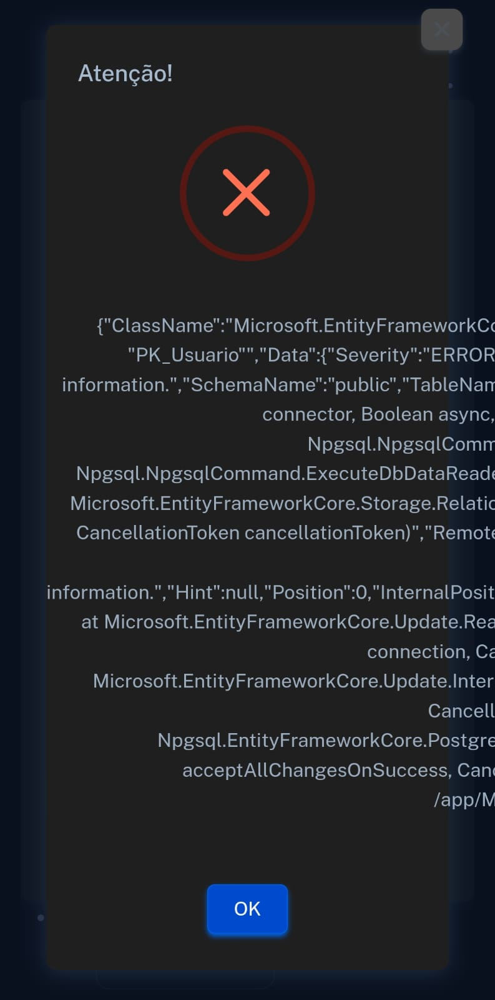

# Planos de Testes de Software

Apresente os cenários de testes utilizados na realização dos testes da sua aplicação. Escolha cenários de testes que demonstrem os requisitos sendo satisfeitos.

Enumere quais cenários de testes foram selecionados para teste. Neste tópico o grupo deve detalhar quais funcionalidades avaliadas, o grupo de usuários que foi escolhido para participar do teste e as ferramentas utilizadas.

**Objetivo dos testes:** Verificar se o sistema atende aos requisitos funcionais, requisitos não funcionais e respeita as restrições definidas para o projeto.

## Testes de Requisitos Funcionais:

#### RF-001:
**Objetivo** A plataforma deve permitir que o administrador crie uma conta de usuário administrativa, a qual será utilizada para cadastrar e gerenciar os produtos disponíveis.

**Passos:**
1.	Acessar a aplicação
2.	Clicar em ‘Crie sua conta’
3.	Inserir nome, email, senha
4.	Clicar em ‘Registrar’

**Critérios de Êxito:**
Deverá receber a mensagem: ‘Usuário criado com sucesso’

#### RF-002:
**Objetivo** A plataforma deve apresentar um catálogo completo de salgados disponíveis para compra, com descrições detalhadas, imagens atrativas e preços atualizados.

**Passos:**
1.	Acessar a aplicação

**Critérios de Êxito:**
Deverá ser exibida a tela com as informações esperadas.

#### RF-003:
**Objetivo** Deve haver um sistema de suporte ao cliente integrado a plataforma, oferecendo canais de comunicação como chat, e-mail ou telefone, para responder dúvidas, resolver problemas e fornecer assistência durante e após a compra.

**Passos:**
1.	Acessar a aplicação
2.	Rolar a página até o final

**Critérios de Êxito:**
No final da página deverá estar o contato para suporte

#### RF-004:
**Objetivo** Deve ser implementado um sistema onde os clientes possam deixar avaliações e comentários sobre os salgados que compraram, bem como sobre a experiência geral de compra na plataforma.

**Passos:**
1	Acessar a aplicação
2.	Localizar o item ‘Comentários’
3.	Clicar no item
4.	Escrever na caixa de texto o comentário
5.	Clicar em ‘Salvar’

**Critérios de Êxito:**
A aplicação deverá exibir o comentário em uma lista
### Requisitos não Funcionais

#### RNF-001:
**Objetivo** A plataforma deve ser compatível com uma variedade de dispositivos e navegadores, garantindo que os clientes possam acessá-lo independentemente do dispositivo que estejam usando.

**Passos:**
1.	Acessar a aplicação em navegadores variados

**Critérios de Êxito:**
A aplicação deverá ser exibida de forma semelhante nos vários navegadores
 
#### RNF-002:
**Objetivo** A plataforma deve ser rápida e responsiva, garantindo tempos de carregamento rápidos e uma experiência de usuário fluida, mesmo em conexões de internet mais lentas.

**Passos:**
1.	Acessar a aplicação
2.	Verificar o tempo necessário para que todo o conteúdo seja exibido

**Critérios de Êxito:**
O tempo para exibição deve ser menor que 1s

#### RNF-003:
**Objetivo** Deve ser implementado um padrão de segurança para proteger os dados do administrador, utilizando criptografia e padrões de segurança de dados.

**Passos:**
1.	Acessar a aplicação
2.	Acessar o painel de login do administrador
3.	Digitar um login ou senha inválidos
4.	Clicar em ‘Entrar’

**Critérios de Êxito:**
Deverá ser exibida uma mensagem de “Usuário ou senha incorretos’ e o acesso impedido

#### RNF-004:
**Objetivo** A plataforma deve ser dimensionável para lidar com picos de tráfego, como horários de pico de pedidos, sem comprometer o desempenho.

**Passos:**
1.	Acessar a aplicação em diferentes plataformas ou dispositivos

**Critérios de Êxito:**
Aplicação sendo executada conforme o requerido

#### RNF-005:
**Objetivo** Deve ser projetado com uma interface intuitiva e fácil de usar, com navegação clara e elementos de design intuitivos, facilitando a busca dos produtos pelos clientes.

**Passos:**
1.	Utilizar conceitos de UX/UI no desenvolvimento da interface
2.	Aplicar questionário para usuários da aplicação, com perguntas sobre facilidade de uso

**Critérios de Êxito:**
Aplicação deverá ter avaliação dos usuários ‘Fácil de utilizar’

## Restrições

O projeto está restrito pelos itens apresentados na tabela a seguir.

#### 01
 **Objetivo** O desenvolvimento da plataforma deve ser concluído dentro de um prazo definido, levando em consideração os objetivos de negócio e as expectativas dos clientes.
 
**Passos:**
1.	Seguir o planejamento das Sprints

**Critérios de Êxito:**
Conclusão dentro do prazo, com aceitação do cliente

#### 02
 **Objetivo** A plataforma deve ser desenvolvida utilizando tecnologias específicas, como uma plataforma de e-commerce ou linguagens de programação específicas, conforme determinado pela equipe de desenvolvimento e pelos requisitos do projeto.
 
**Passos:**
1.	Utilizar as tecnologias definidas na Especificação do Projeto

**Critérios de Êxito:**
Aplicação concluída com as tecnologias utilizadas conforme o planejamento

#### 03
 **Objetivo** A plataforma deve ser desenvolvida levando em consideração as restrições de infraestrutura existentes, como limitações de hardware, largura de banda de rede e capacidade de armazenamento, garantindo que a infraestrutura suporte adequadamente as necessidades do site.
 
**Passos:**
1.	Selecionar os provedores de infraestrutura
2.	Configurar corretamente os ambientes de produção

**Critérios de Êxito:**
Aplicação sendo executada conforme o requerido
 
# Evidências de Testes de Software

Apresente imagens e/ou vídeos que comprovam que um determinado teste foi executado, e o resultado esperado foi obtido. Normalmente são screenshots de telas, ou vídeos do software em funcionamento.

#### RF-001:
Falha no lançamento da aplicação.

Video da aplicação de cadastro e login em funcionamento.

### Planejamento de Testes de Software - MM Salgados
Foi criado a tabela de Planejamento de Testes de Software para organização dos testes da aplicação.

_page-0001.jpg](https://github.com/ICEI-PUC-Minas-PMV-ADS/mm-salgados/blob/desenvolvimento/documentos/img/PLANEJAMENTO%20DE%20TESTES%20DE%20SOFTWARE%20-%20MM%20SALGADOS%20(3)_page-0001.jpg)
_page-0002.jpg](https://github.com/ICEI-PUC-Minas-PMV-ADS/mm-salgados/blob/desenvolvimento/documentos/img/PLANEJAMENTO%20DE%20TESTES%20DE%20SOFTWARE%20-%20MM%20SALGADOS%20(3)_page-0002.jpg)
_page-0003.jpg)](https://github.com/ICEI-PUC-Minas-PMV-ADS/mm-salgados/blob/desenvolvimento/documentos/img/PLANEJAMENTO%20DE%20TESTES%20DE%20SOFTWARE%20-%20MM%20SALGADOS%20(3)_page-0003.jpg)

### RF-001.3
Vídeo do teste do Requisito Funcional RF-001.3 - Verificar se o sistema impede a criação de contas duplicadas com o mesmo e-mail. 

)

### Resultado: O teste "RF-001.3 - Verificar se o sistema impede a criação de contas duplicadas com o mesmo e-mail" foi executado com sucesso. 

